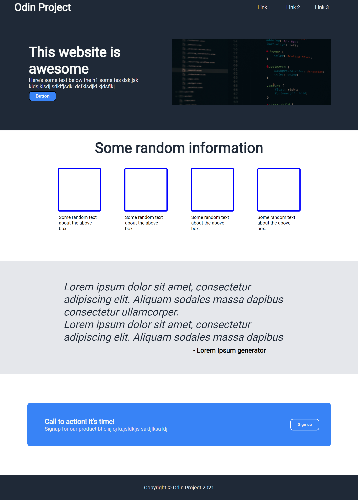

<h1>Primeiro Projeto do Odin - Meus jogos favoritos</h1>

<h1> O que é isto? </h1>

> 
Este é o primeiro projeto pedido pelo <a href="https://www.theodinproject.com/about">Odin Project</a> que consiste em criar um template de página web com base em uma imagem fornecida (como uma dinâmica de mímica). A imagem pedida para recriar o template está localizada logo abaixo:

 <strong>Template pedido para desenvolver</strong> 

<h1> Template Desenvolvido</h1>

> 
Abaixo está o template inicialmente desenvolvido com base na imagem fornecida

<h2>Você pode ver o resultado final <a href="https://pvictox.github.io/My-Steam-Games---Odin-Project/">aqui!</a> Resolvi modificar o template com um hobby meu.</h2>